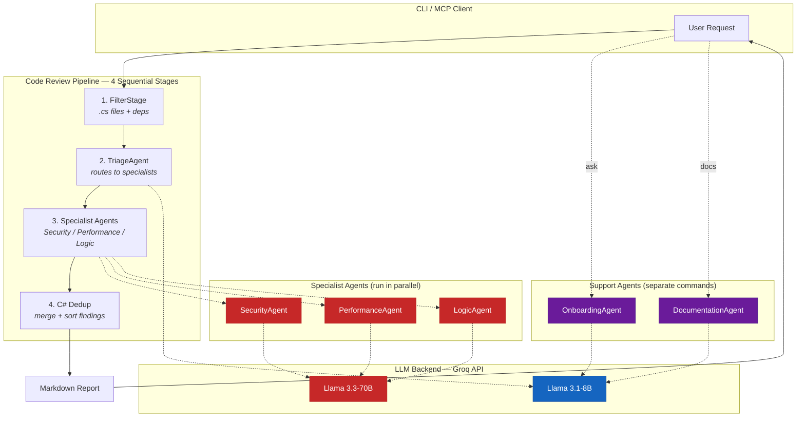
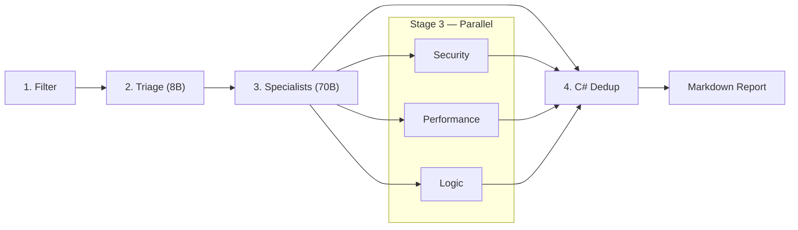
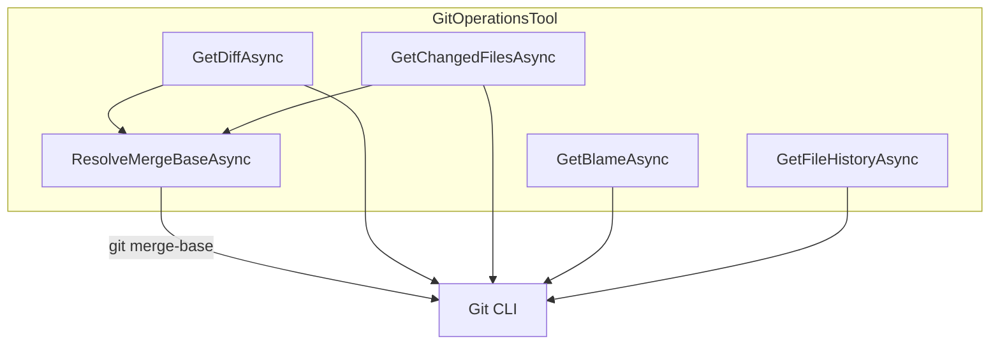
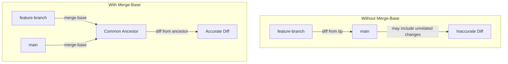
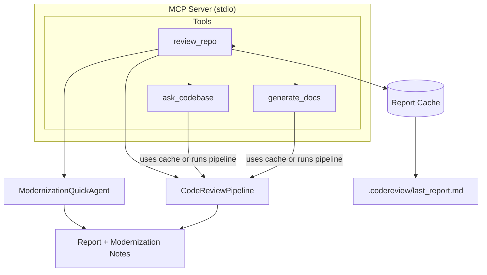
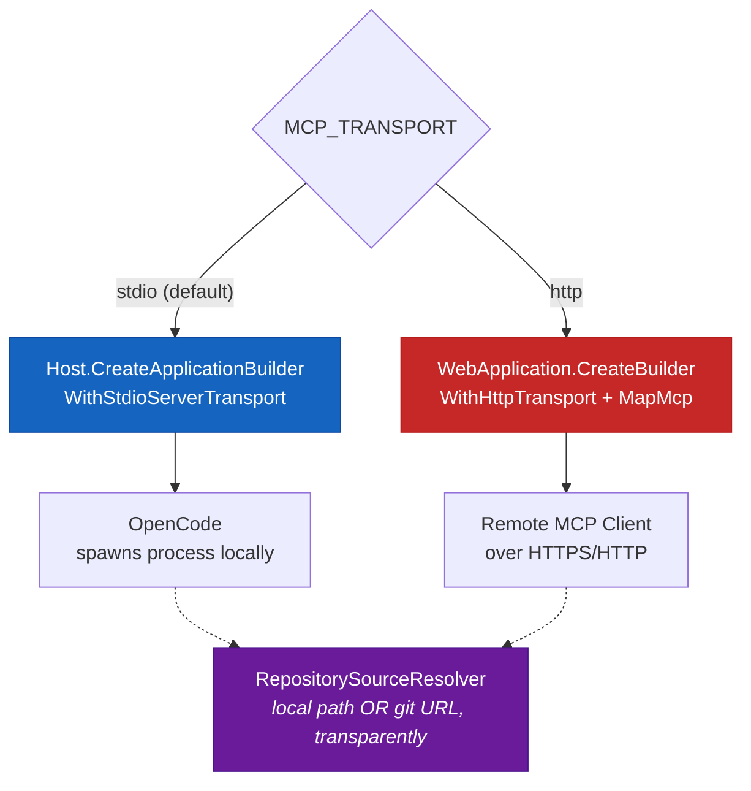
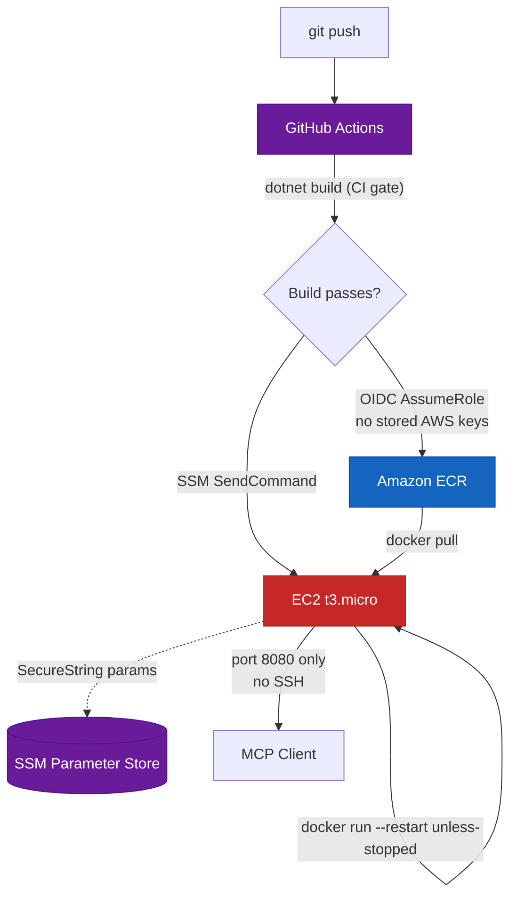
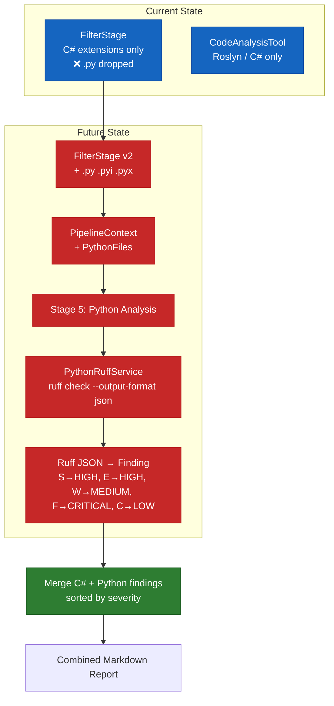

# Multi-Agent Code Review System

> **Intelligent, automated code review powered by multi-agent AI**

A production-grade multi-agent code review system built with Microsoft AutoGen and Groq's Llama models. Analyzes C# projects with specialized agents for security, performance, and logic analysis. Exposed as an **MCP server** for seamless integration with OpenCode, VS Code, Claude Desktop, and other MCP clients. **Deployed and live** on both Render (REST API) and AWS (full MCP server over HTTP) — see [Deployment](#deployment) for details.

---

## Architecture



---

## System Architecture

### Project Dependency Graph

```
MultiAgentCodeReview.Core          (no dependencies)
    ↑
MultiAgentCodeReview.Agents        (references Core)
    ↑
MultiAgentCodeReview.Orchestration (references Core + Agents)
    ↑
    ├── MultiAgentCodeReview.Host        (references Orchestration)
    └── MultiAgentCodeReview.McpServer   (references Orchestration + Agents)
```

> **Note:** `MultiAgentCodeReview.McpServer` is not yet part of `MultiAgentCodeReview.slnx` — build it separately with `dotnet build MultiAgentCodeReview.McpServer`.

### Projects

| Project | Purpose | Key Files |
|---------|---------|-----------|
| `MultiAgentCodeReview.Core` | Domain models, interfaces, config, prompts, rate limiting | `IAgent.cs`, `Finding.cs`, `PipelineContext.cs`, `AgentPrompts.cs` |
| `MultiAgentCodeReview.Agents` | AutoGen agents (Triage, 3 Specialists, Docs, Onboarding) | `TriageAgent.cs`, `SpecialistAgents.cs`, `AgentFactory.cs` |
| `MultiAgentCodeReview.Orchestration` | DI container, pipeline orchestrator, Roslyn/Git tools | `CodeReviewPipeline.cs`, `FilterStage.cs`, `GitOperationsTool.cs` |
| `MultiAgentCodeReview.Host` | Console entry point (CLI commands) | `Program.cs` |
| `MultiAgentCodeReview.McpServer` | MCP server exposing tools via stdio transport | `Program.cs`, `CodeReviewMcpTools.cs` |

---

## Agents

| Agent | Role | Model | Speed |
|-------|------|-------|-------|
| **Triage** | Classifies changes, routes to specialists | llama-3.1-8b-instant | 2-3s |
| **Security** | SQLi, XSS, auth bypass, crypto, secrets | llama-3.3-70b-versatile | 2-3s |
| **Performance** | N+1, blocking calls, memory, O(n²), caching | llama-3.3-70b-versatile | 2-3s |
| **Logic** | Logic errors, SOLID violations, complexity, code smells | llama-3.3-70b-versatile | 2-3s |
| **ModernizationQuick** | Quick-scan for outdated patterns, old packages, legacy APIs | llama-3.1-8b-instant | 2-3s |
| **Documentation** | Generates README, API docs, Architecture | llama-3.1-8b-instant | 4-5s |
| **Onboarding** | Answers developer questions from codebase context | llama-3.1-8b-instant | 3-4s |

---

## Pipeline Stages



### Stage Details

| Stage | What it does | Key implementation |
|-------|-------------|-------------------|
| **Filter** | Git diff + Roslyn dependency graph → source files only | `FilterStage.cs` — excludes `.md`, `.json`, `.xml`, etc. |
| **Triage** | 8B model classifies diff, routes to 1-3 specialists | `TriageAgent.cs` — outputs `{"selected_agents":[...]}` |
| **Specialists** | 3 agents launched in parallel via `Task.WhenAll`, staggered 15s apart | Staggered to respect Groq free-tier rate limits (30 RPM / 12K TPM); each agent works on the 70B model through Groq API |
| **Dedup** | C# code merges findings, boosts cross-agent agreement | `CodeReviewPipeline.cs` — no LLM call needed |
| **ModernizationQuick** | Quick-scan for outdated patterns and legacy APIs | `ModernizationQuickAgent.cs` — 8B model, runs after the pipeline via the `review_repo` MCP tool |

---

## Key Functions

### GitOperationsTool



| Function | Description | Returns |
|----------|-------------|---------|
| `GetDiffAsync(fromRef, toRef)` | Gets unified diff between two refs, resolved through merge-base | `GitDiff` |
| `GetChangedFilesAsync(fromRef, toRef)` | Lists changed files between two refs, resolved through merge-base | `List<string>` |
| `GetBlameAsync(filePath)` | Gets blame info for a file (first 1000 lines) | `List<BlameLine>` |
| `GetFileHistoryAsync(filePath, limit)` | Gets commit history for a file | `List<Commit>` |
| `ResolveMergeBaseAsync(fromRef, toRef)` | Resolves common ancestor between two refs | `string` |

### CodeAnalysisTool (Roslyn)

| Function | Description | Returns |
|----------|-------------|---------|
| `GetCyclomaticComplexityAsync(filePath, methodName)` | Calculates cyclomatic complexity | `int` |
| `GetDependencyGraphAsync(filePath)` | Builds dependency graph from usings/type refs | `DependencyGraph` |
| `FindCallersAsync(filePath, methodName)` | Finds all callers of a method | `List<CallSite>` |
| `DetectCodeSmellsAsync(filePath)` | Detects code smells (long methods, large classes, etc.) | `List<CodeSmell>` |

### AgentFactory

| Function | Description | Returns |
|----------|-------------|---------|
| `CreateTriageAgent()` | Creates triage agent with 8B model | `ITriageAgent` |
| `CreateSecurityAgent()` | Creates security specialist with 70B model | `ISpecialistAgent` |
| `CreatePerformanceAgent()` | Creates performance specialist with 70B model | `ISpecialistAgent` |
| `CreateLogicAgent()` | Creates logic specialist with 70B model | `ISpecialistAgent` |
| `CreateModernizationQuickAgent()` | Creates quick-scan modernization agent with 8B model | `IAgent` |
| `CreateDocumentationAgent()` | Creates documentation agent with 8B model | `IDocumentationAgent` |
| `CreateOnboardingAgent()` | Creates onboarding agent with 8B model | `IOnboardingAgent` |

---

## Merge-Base Resolution

The system automatically resolves refs to their common ancestor before computing diffs. This ensures accurate diffs even when comparing branches with complex merge histories.

### How It Works



### Implementation

```csharp
private async Task<string> ResolveMergeBaseAsync(string fromRef, string toRef)
{
    try
    {
        var output = await RunGitCommandAsync($"merge-base {fromRef} {toRef}");
        if (!string.IsNullOrWhiteSpace(output))
            return output.Trim();
    }
    catch (Exception ex)
    {
        Console.Error.WriteLine($"[GitOperationsTool] merge-base failed, falling back to fromRef: {ex.Message}");
    }
    return fromRef;
}
```

### Behavior

- **Normal case**: Resolves `fromRef` to the common ancestor of `fromRef` and `toRef`
- **Fallback**: If `git merge-base` fails, uses `fromRef` as-is (logs warning)
- **Transparency**: All callers (`FilterStage`, MCP tools) benefit automatically

---

## Agent-Computer Interface (ACI)

The pipeline injects absolute line numbers into diff content before sending to specialists:

```
# Raw git diff (LLM must count lines):
@@ -40,4 +40,5 @@
  public void ProcessData(string userInput) {
-     RunQuery(userInput);
+     db.Execute($"SELECT * FROM Users WHERE Name = '{userInput}'");

# Injected line numbers (LLM copies directly):
[Line 40]  public void ProcessData(string userInput) {
[-]         -     RunQuery(userInput);
[Line 41]  +     db.Execute($"SELECT * FROM Users WHERE Name = '{userInput}'");
```

Specialists are instructed to use `<thinking>` tags before outputting JSON, ensuring accurate line number extraction.

---

## MCP Tools

The MCP server exposes 3 tools over stdio transport. `review_repo` also runs a lightweight modernization quick-scan after the pipeline completes and appends the results as a `## Quick Modernization Notes` section to the report.



| Tool | Description | When to use |
|------|-------------|-------------|
| `review_repo` | Run full multi-agent review + modernization quick-scan | "Review this commit", "Check this PR" |
| `ask_codebase` | Ask natural language questions about codebase | "Where is auth handled?", "What calls X?" |
| `generate_docs` | Generate project documentation | "Generate docs", "Create README" |

---

## Quick Start

### Option 1: CLI

```bash
# 1. Clone and build
git clone https://github.com/bhavyananda17/MultiAgentCodeReview.git
cd MultiAgentCodeReview
dotnet build

# 2. Configure
cp .env.example .env
# Edit .env and add your GROQ_API_KEY

# 3. Run review
dotnet run --project MultiAgentCodeReview.Host -- review <repo-path> <commit-hash> [base-commit]

# 4. Run docs
dotnet run --project MultiAgentCodeReview.Host -- docs <repo-path> <commit-hash> [base-commit]
```

### Option 2: MCP Server (OpenCode)

```bash
# 1. Build
dotnet build MultiAgentCodeReview.McpServer

# 2. Add to opencode.json (see MCP_SETUP.md for details)
# 3. Restart OpenCode and use the tools
```

See [MCP_SETUP.md](MCP_SETUP.md) for detailed MCP configuration.

---

## Deployment

Two live cloud deployments run alongside local/stdio usage, each covering a different slice of the system:

| Deployment | What's live | Stack | Auth |
|------------|-------------|-------|------|
| **Render** | Thin REST wrapper (`POST /api/review`) around the core pipeline | `MultiAgentCodeReview.Api`, Docker, Render (scale-to-zero), GitHub Actions CI/CD | `X-Api-Key` header |
| **AWS** | The real MCP server — all 3 tools over HTTP transport | `MultiAgentCodeReview.McpServer`, Docker, EC2 + ECR + SSM, GitHub Actions CI/CD via OIDC | `X-Api-Key` header |

### McpServer: Dual Transport

`MultiAgentCodeReview.McpServer` speaks either transport depending on `MCP_TRANSPORT`, so local OpenCode usage is unaffected by the cloud deployment:



`RepositorySourceResolver` lets `repo_path` be either a local filesystem path (used as-is, stdio behavior unchanged) or a git URL (cloned to a temp dir and cleaned up after), so all 3 tools work identically whether the caller shares a filesystem with the server or not.

### AWS Deployment Architecture



- **IAM roles, least privilege:** the GitHub Actions role can only push to this one ECR repo and send commands to this one EC2 instance; the EC2 instance role can only pull from this one ECR repo and read this project's own SSM parameter path.
- **No SSH:** deploys happen entirely over IAM-authenticated SSM `send-command` — port 22 is never opened.
- **Secrets:** `GROQ_API_KEY`, the MCP API key, and all per-role model overrides live in SSM Parameter Store as `SecureString`, fetched by a script on the instance at container-run time — never passed through the GitHub Actions command payload.
- **Cost control:** the instance is started/stopped manually rather than kept running continuously; the container's `--restart unless-stopped` policy means it comes back on its own after a stop/start with no redeploy needed.

---

## Configuration

All settings via environment variables (prefix `MULTIAGENT_`):

| Variable | Description | Default |
|----------|-------------|---------|
| `GROQ_API_KEY` | **Required** Groq API key | — |
| `GROQ_BASE_URL` | Groq OpenAI-compatible endpoint | `https://api.groq.com/openai` |
| `MODEL_<ROLE>` | Override model per role (e.g., `MODEL_SECURITY`) | Role-specific |
| `MODEL_<ROLE>_TEMP` | Temperature override | Role-specific |
| `MODEL_<ROLE>_TOKENS` | Max tokens override | Role-specific |

Example `.env`:
```bash
GROQ_API_KEY=gsk_xxx
GROQ_BASE_URL=https://api.groq.com/openai
MODEL_TRIAGE=llama-3.1-8b-instant
```

---

## Performance

| Metric | Value |
|--------|-------|
| Total LLM calls | 5 (triage + 3 specialists + modernization quick) |
| Specialist execution | Parallel via `Task.WhenAll` (staggered 15s apart) |
| Modernization Quick | Sequential 8B call after the pipeline (via `review_repo` tool) |
| Synthesis | C# dedup (<1ms) |
| Wall time | ~30-45s (15s stagger + per-agent latency) |

> **Parallelism note:** The architecture is parallel by design — all specialist agents are launched together via `Task.WhenAll`. A fixed 15s stagger is applied between their starts to respect Groq free tier rate limits (30 RPM / 12K TPM on llama-3.3-70b-versatile). Requests that still hit a 429 are retried automatically with backoff.

---

## Status

**Working pipeline** — Core pipeline functional with parallel execution, accurate line numbers, and cross-agent deduplication.

### Known gaps
- Rate limiting infrastructure built but not fully wired
- RAG/knowledge search interfaces defined but unimplemented
- Roslyn analysis limited to C# projects
- Python/Ruff integration planned — see [below](#pythonruff-integration-planned)

### Python/Ruff integration (planned)

The pipeline is currently C#-only: `FilterStage` whitelists `.cs`, `.csproj`, `.fsproj`, `.vbproj`, `.sln`, `.fs`, `.fsx`, `.props`, `.targets` (so `.py` files are silently dropped), and `CodeAnalysisTool` is Roslyn/C# only. The plan is to add a Python analysis stage powered by Ruff:



**Implementation checklist:**
- `FilterStage.cs` — add `.py`, `.pyi`, `.pyx` to the source extension whitelist and categorize files into C# vs Python
- `PipelineContext` — add a `PythonFiles` collection
- `CodeReviewPipeline.cs` — add a Python analysis step after synthesis when Python files are present
- **New:** `IPythonRuffService` (Core/Interfaces) + `PythonRuffService` (Orchestration)
- Register `IPythonRuffService` in `ServiceCollectionExtensions.cs`
- Env vars: `PYTHON_RUFF_SERVICE_URL` (HTTP option) or `RUFF_EXECUTABLE_PATH` (process option)

**Service options:** (A) HTTP endpoint that shells out to `ruff check --output-format json`, (B) direct process invocation of the `ruff` CLI, or (C) embedded Python via Python.NET.
